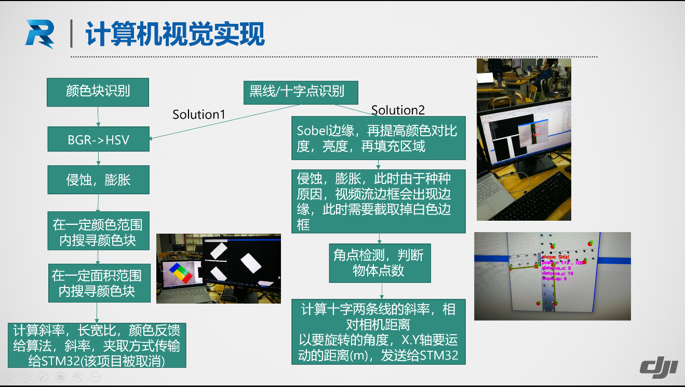

ObjectDetection, serial communication and data process in Manifold (DJI).
=========================================================================

(Solution for RoboMaster 2018 summer camp)

#### Referred documents

-   Lightweight Communications and Marshalling (LCM):

http://lcm-proj.github.io/

-   OpenCV3.4.0:

    -   Python:

>   http://opencv-python-tutroals.readthedocs.io/en/latest/index.html

-   C++:

>   <http://www.learnopencv.com/opencv-transparent-api/>

https://docs.opencv.org/

### Projects instruction

-   ConsoleApplication: This is a test file, which can be ignored.

-   CppTrackCross: This file can be used to detect the cross and calculate the
    data.

-   CppTrackTour: This file can be used to detect the black line and calculate
    the data.

-   HarrisConer: This file included harris coner detection.(In HarrisConer.cpp)

-   CppTrackTour: This file can be used to detect the black line and calculate
    the data.

-   LinuxMainProgram:

    -   info_head.hpp/info_inter.hpp: LCM’s libraries(essential)

    -   SerialPort.h: Linux’s serial communication program.

    -   Main1.cpp: init the serial ports(call SerialPort.h) and
        LCM(info_head.hpp/info_inter.hpp).At the same time, receive the data
        stream from MacBook, process the data and transport the data to the
        MCU(STM32)

-   PythonApplication: Varieties of opencv program (using Python2.7),Such as
    Shape detection, track tour, and so on.
